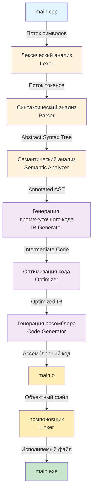

# Фазы компиляции

Диаграмма основных фаз процесса компиляции исходного кода в исполняемую программу на примере языка C++.

## Описание фаз

### 1. Лексический анализ (Lexical Analysis / Lexer)
- **Входные данные**: Исходный код C++ (main.cpp)
- **Выходные данные**: Поток токенов (keywords, identifiers, operators, literals)
- **Функция**: Разбивает исходный код на лексемы, удаляет комментарии и пробелы

### 2. Синтаксический анализ (Syntax Analysis / Parser)
- **Входные данные**: Поток токенов
- **Выходные данные**: Abstract Syntax Tree (AST)
- **Функция**: Проверяет синтаксическую корректность C++ и строит дерево разбора

### 3. Семантический анализ (Semantic Analysis)
- **Входные данные**: Abstract Syntax Tree
- **Выходные данные**: Annotated AST
- **Функция**: Проверяет типизацию C++, область видимости, разрешение перегрузок

### 4. Генерация промежуточного кода (IR Generation)
- **Входные данные**: Annotated AST
- **Выходные данные**: Intermediate Representation (LLVM IR, RTL)
- **Функция**: Преобразует AST в промежуточное представление для оптимизации

### 5. Оптимизация кода (Optimization)
- **Входные данные**: Intermediate Code
- **Выходные данные**: Optimized IR
- **Функция**: Выполняет оптимизации: inline функций, устранение мертвого кода, векторизация

### 6. Генерация ассемблера (Code Generation)
- **Входные данные**: Optimized IR
- **Выходные данные**: Ассемблерный код (x86-64, ARM)
- **Функция**: Преобразует IR в ассемблер целевой архитектуры

### 7. Ассемблирование и компоновка (Assembly & Linking)
- **Входные данные**: Ассемблерный код
- **Выходные данные**: Исполняемый файл (main.exe)
- **Функция**: Ассемблер создает объектный файл, компоновщик связывает с библиотеками