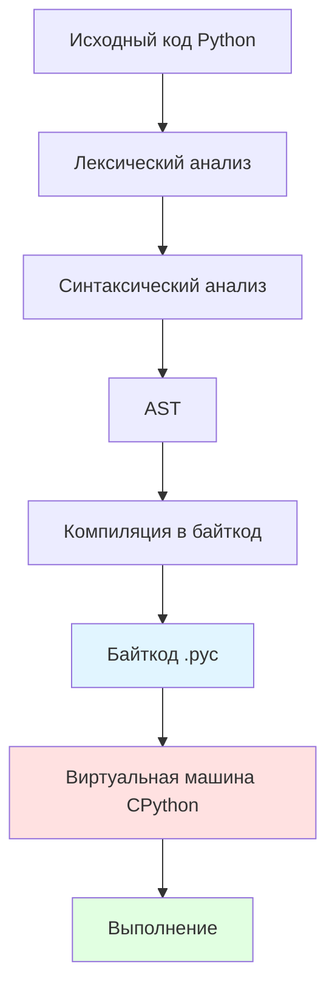
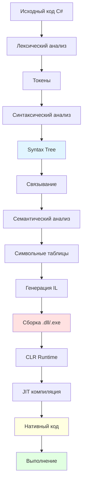
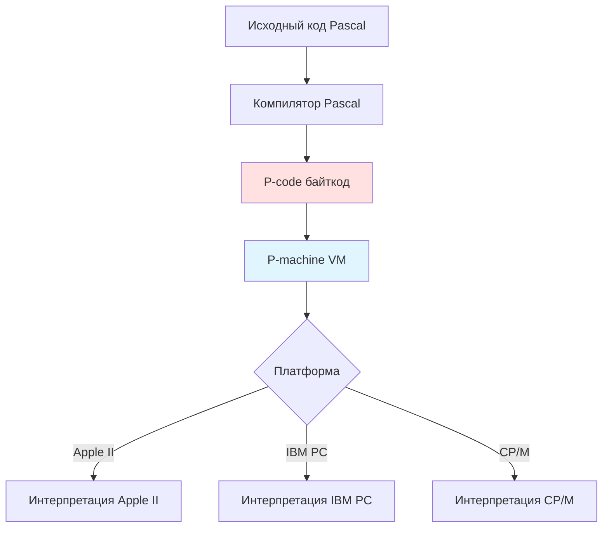
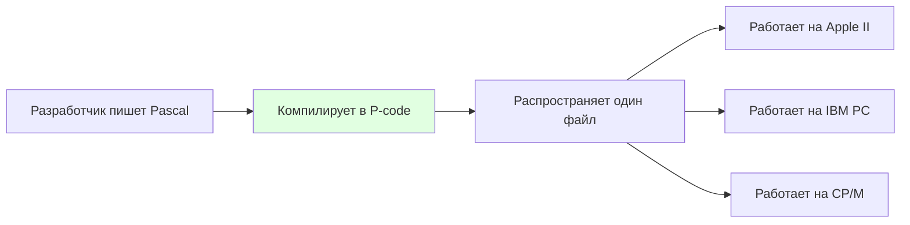
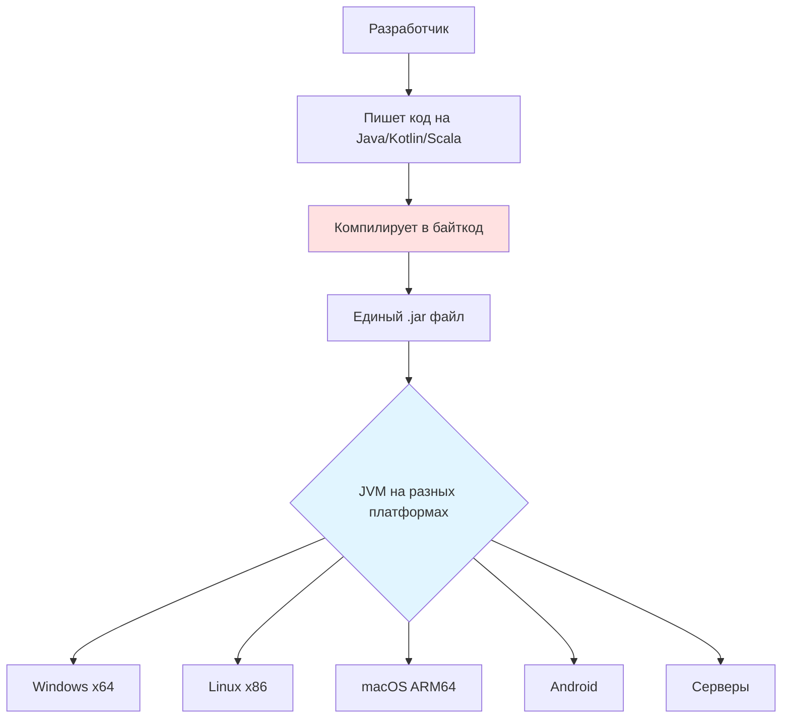
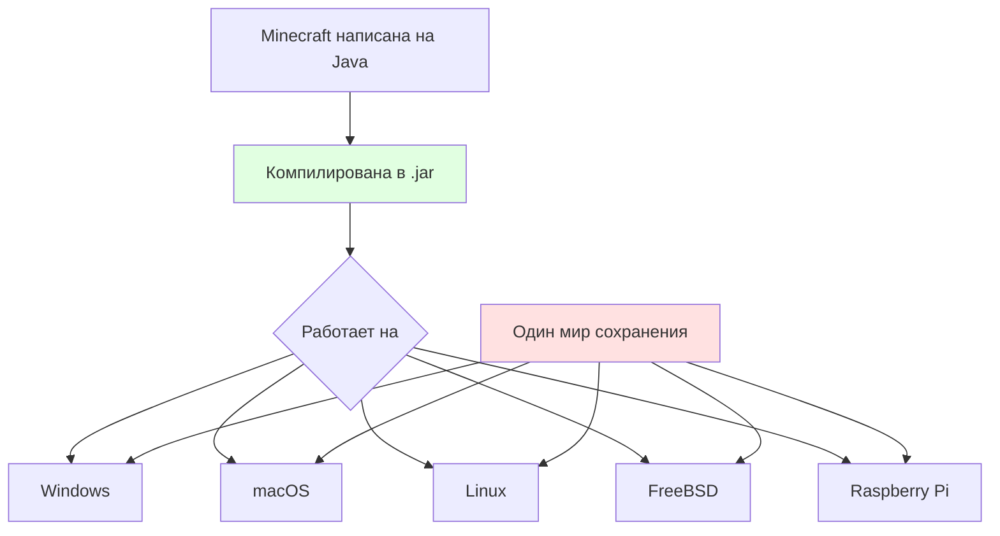

# Ответы на вопросы по компиляторам

## 1. UML диаграмма для работы интерпретатора CPython и компилятора Roslyn

### CPython интерпретатор



**Фазы работы CPython:**
1. **Лексический анализ** - токенизация исходного кода
2. **Синтаксический анализ** - построение дерева разбора
3. **Построение AST** - абстрактное синтаксическое дерево
4. **Компиляция в байткод** - генерация .pyc файлов
5. **Интерпретация** - выполнение байткода в виртуальной машине

**Примечание:** Стандартный CPython не использует JIT-компиляцию, но PyPy (альтернативная реализация Python) использует JIT для ускорения выполнения.

### Roslyn компилятор C#



**Фазы работы Roslyn:**
1. **Лексический анализ** - разбиение на токены
2. **Синтаксический анализ** - построение синтаксического дерева
3. **Связывание и семантический анализ** - проверка типов, разрешение имен
4. **Генерация IL** - генерация промежуточного языка (CIL)
5. **Создание сборки** - .dll или .exe с метаданными
6. **JIT компиляция в CLR** - компиляция IL в нативный код во время выполнения
7. **Выполнение** - исполнение машинного кода

**Особенности Roslyn:**
- Компилятор как сервис (Compiler-as-a-Service)
- Открытый API для анализа и трансформации кода
- Поддержка инкрементальной компиляции
- Возможность AOT компиляции (Native AOT в .NET 7+)

### Сравнение CPython и Roslyn

| Характеристика | CPython | Roslyn C# |
|----------------|---------|-----------|
| Промежуточное представление | Байткод Python | IL (CIL) |
| Метод выполнения | Интерпретация байткода | JIT компиляция в нативный код |
| Производительность | Медленнее | Быстрее |
| Типизация | Динамическая | Статическая |
| Компиляция | В runtime | Сборка заранее, JIT в runtime |

---

## 2. История виртуальной машины с байткодом

### Появление концепции виртуальной машины

**Первая виртуальная машина с байткодом: UCSD Pascal p-code (1977-1978)**

#### Хронология развития:

**1. UCSD Pascal (1977-1978)**
- **Где:** Калифорнийский университет в Сан-Диего (UCSD)
- **Когда:** 1977-1978 годы
- **Для какого языка:** Pascal
- **Создатель:** Кеннет Боулз (Kenneth Bowles)

**Зачем появилась:**
- **Портабельность** - один и тот же код мог работать на разных платформах (Apple II, IBM PC, Z80)
- **Компактность** - байткод занимал меньше места
- **Защита кода** - исходный код не распространялся
- **Упрощение компиляции** - не нужно было создавать полноценный компилятор для каждой платформы



**2. Smalltalk-80 (1980)**
- Виртуальная машина для объектно-ориентированного языка
- Байткод для абстрактной машины
- Повлияла на многие последующие VM

**3. Java Virtual Machine (1995)**
- **Где:** Sun Microsystems
- **Когда:** 1995
- **Слоган:** "Write Once, Run Anywhere" (WORA)
- Революционизировала концепцию виртуальных машин с JIT-компиляцией

**4. .NET CLR (2002)**
- Виртуальная машина для множества языков
- Common Intermediate Language (CIL/MSIL)

**5. Python, Ruby, Lua и другие (1990-2000-е)**
- Использование байткода для интерпретируемых языков

### Зачем появились виртуальные машины с байткодом?

#### Основные причины:

1. **Портабельность кода**
   - Один скомпилированный файл работает на разных платформах
   - Не нужно перекомпилировать для каждой ОС

2. **Независимость от архитектуры**
   - Байткод не зависит от процессора (x86, ARM, MIPS и т.д.)
   - Виртуальная машина адаптирует выполнение под конкретное железо

3. **Безопасность**
   - VM может контролировать доступ к памяти и ресурсам
   - Песочница (sandbox) для выполнения ненадежного кода
   - Верификация байткода перед выполнением

4. **Оптимизация производительности**
   - JIT-компиляция горячих участков кода в runtime
   - Профилирование и адаптивная оптимизация
   - Сборка мусора (Garbage Collection)

5. **Упрощение разработки компиляторов**
   - Компилятор генерирует промежуточный код
   - Не нужно знать особенности каждой платформы

6. **Динамическая загрузка кода**
   - Возможность загружать и выполнять код во время работы программы
   - Важно для веб-приложений (Java апплеты, позже JavaScript V8)

---

## 3. Кому помогает кроссплатформенность виртуальной машины

### Pascal Machine (UCSD P-code) - исторический пример

#### Кому помогла:

**1. Разработчикам программного обеспечения:**



**Преимущества для разработчиков:**
- **Экономия времени** - не нужно адаптировать код под каждую платформу
- **Единая кодовая база** - легче поддерживать
- **Быстрый выход на рынок** - одна версия для всех платформ

**2. Производителям оборудования:**
- Только нужно было портировать саму виртуальную машину (P-machine интерпретатор)
- После этого все Pascal программы автоматически работали на новой платформе
- Привлекало больше разработчиков к платформе

**3. Образовательным учреждениям:**
- Студенты могли изучать Pascal на любых доступных компьютерах
- Программы работали одинаково везде
- Не нужно было покупать определенное железо

### Java Virtual Machine (JVM) - современный пример



#### Кому помогает JVM:

**1. Enterprise разработчикам:**
- **Пример:** Банковская система написана на Java
- Один и тот же .jar файл работает на:
  - Windows серверах в одном датацентре
  - Linux серверах в другом датацентре
  - AIX серверах (Unix) для критичных систем
  - macOS для разработчиков
- **Экономия:** Не нужно поддерживать 4 разных версии кода

**2. Веб-приложениям (Backend):**

Пример: Spring Boot приложение
- Один .jar файл работает на:
  - AWS Linux серверах
  - Azure Windows серверах
  - Google Cloud
  - On-premise серверах
  - Docker контейнерах
  - Kubernetes кластерах

**3. Android разработчикам:**
- Весь Android основан на модифицированной JVM (Dalvik → ART)
- Приложения пишутся на Java/Kotlin → компилируются в байткод → работают на миллиардах устройств
- Разные процессоры (ARM, ARM64, x86) - один и тот же APK

**4. Полиглот-разработчикам:**
- На JVM работают многие языки:
  - Java, Kotlin, Scala, Groovy, Clojure, JRuby, Jython
- Можно использовать разные языки в одном проекте
- Все они компилируются в один и тот же байткод

**5. DevOps инженерам:**
- Упрощается развертывание - одинаковый процесс для всех платформ
- Контейнеризация проще - один базовый образ JVM
- Миграция между облаками безболезненна

### Сравнительная таблица выгод

| Кто | Без VM | С VM (Pascal/JVM) | Выгода |
|-----|--------|-------------------|--------|
| Разработчик | Поддерживает 5 версий кода для разных ОС | Поддерживает 1 версию | Экономия 80% времени на поддержку |
| Тестировщик | Тестирует 5 разных сборок | Тестирует 1 сборку | Быстрее выпуск |
| Бизнес | Задержка выхода на рынок | Одновременный выход на всех платформах | Конкурентное преимущество |
| Пользователь | Не все функции на всех платформах | Одинаковая функциональность везде | Лучший UX |

### Реальный пример: Minecraft



**Выгода для Mojang/Microsoft:**
- Не нужно поддерживать 5 разных версий игры
- Все игроки получают обновления одновременно
- Моды и плагины работают на всех платформах

### Аргументация: Почему это важно

#### Для Pascal Machine (1970-е годы):

В конце 1970-х было огромное разнообразие несовместимых компьютеров:
- Apple II
- Commodore PET
- TRS-80
- IBM PC (позже)
- Различные CP/M машины

**Без P-code:**
```
Разработка игры =
  Написать на Apple II (6502 ассемблер) +
  Переписать на Commodore (другой 6502) +
  Переписать на TRS-80 (Z80 ассемблер)
= 3 месяца × 3 платформы = 9 месяцев
```

**С P-code:**
```
Разработка игры =
  Написать на Pascal (1 раз) +
  Скомпилировать в P-code
= 3 месяца для всех платформ
```

#### Для JVM (современность):

**Задача:** Разработать корпоративную CRM систему

**Без JVM (нативный код на C++):**
- Компилировать для Windows (MSVC)
- Компилировать для Linux (GCC)
- Компилировать для macOS (Clang)
- Решать проблемы с зависимостями на каждой платформе
- Разное поведение системных вызовов
- Разные баги разных компиляторов

**С JVM:**
- Написать один раз на Java/Kotlin
- `mvn package` → получить .jar
- Запустить везде где есть JVM

### Вывод

**Кроссплатформенность виртуальных машин помогает:**

1. **Разработчикам** - писать код один раз
2. **Бизнесу** - экономить деньги на разработке и поддержке
3. **Пользователям** - получать одинаковый опыт на всех платформах
4. **Экосистеме** - создавать библиотеки и фреймворки, которые работают везде
5. **Образованию** - студенты изучают один язык, применимый везде

**Историческая значимость:**
- Pascal Machine доказала жизнеспособность концепции в 1970-х
- JVM сделала её мейнстримом в 1990-х
- Сегодня это стандарт индустрии (JVM, .NET, Python VM, JavaScript V8)